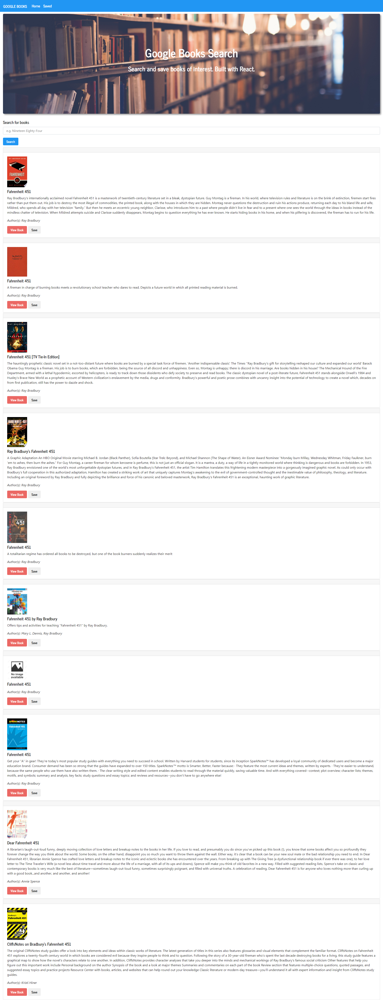
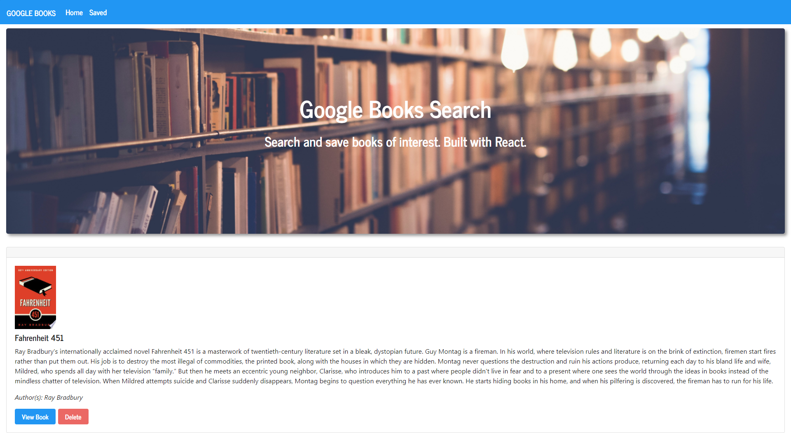

# Google Books - React App

## Links:

Deployed Application: https://mysterious-headland-88758.herokuapp.com/  
Repository: https://github.com/mbussert/react-google-books

## Description:

A full-stack application (MERN) built with React that allows users to search for books through the Google Books API, view, and save their results to a database using MongoDB.

## Table of Contents:

- [Installation](#installation)
- [Usage](#usage)
- [License](#license)
- [Contributing](#contributing)
- [Testing](#tests)
- [Contact](#contact)

## Installation:

The source code can be installed by running `npm install`, and then running `npm start`.

## Usage:

A user can search for their favorite book, view a list of results returned by the Google Books API, and then view each book individually or save a book to their reading list. From the `Saved Books` page, a user can view or delete any book they added.

## License:

This application is covered under the MIT License.

## Contributing:

Users are free to contribute to this project.

## Tests:

No tests have been created for this application.

## Questions:

GitHub: [mbussert](https://github.com/mbussert)  
 By Email: [mbussert@gmail.com](mailto:mbussert@gmail.com)
